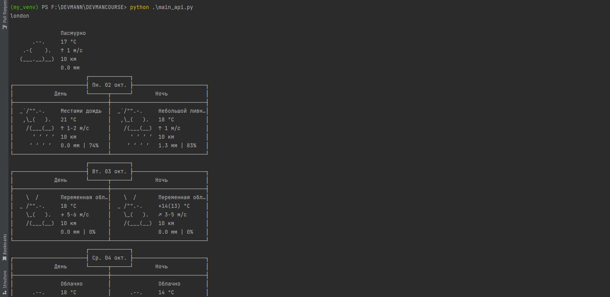

# Получите погоду в терминале
___

## Как установить и запустить программу

* Python 3.6 или выше должен быть уже установлен. 
* Установите необходимы библиотеки:
```
python -m pip install -r requirements.txt
```

* Для запуска скрипта необходимо выполнить команду:
```
python main_api.py
```


В результате в консоле скрипт выведет погоду для трех городов из списка. 
Пример выполнения скрипта:



## Цель проекта ##
Код написан в образовательных целях на онлайн-курсе для веб-разработчиков dvmn.org.